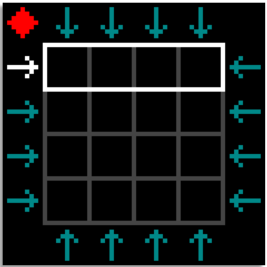
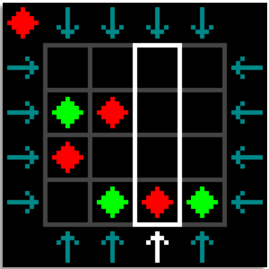
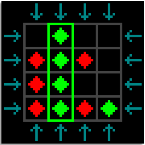

## Aperçu

    
    
    

## Description.

Il s'agit de l'implémentation du jeu de glisse dans l'environnement **codeBoot**. Ce code est écrit en Python.
Il a été écrit dans le cadre d'un travail pratiqe du cours **IFT 1015: Introduction à la Programmation**.

## Auteurs

- **Josué Mongan**  
  GitHub : [Josh012006](https://github.com/Josh012006)  
- **Kuzatw**  
  GitHub : [kuzatw](https://github.com/kuzatw)

## Droits d'auteurs

En raison de la politique de lutte contre le plagiat de l'Université, ce code **n'est pas libre d'utilisation**.
S'il advient que vous vous en serviez pour exécuter un quelconque travail, **veuillez clairement le mentionner ainsi que les auteurs**.